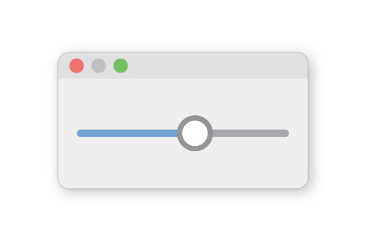
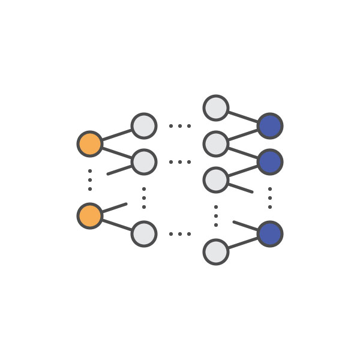
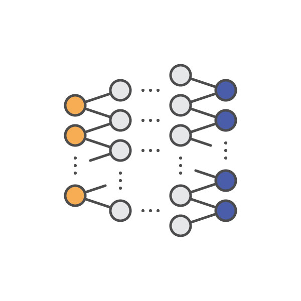
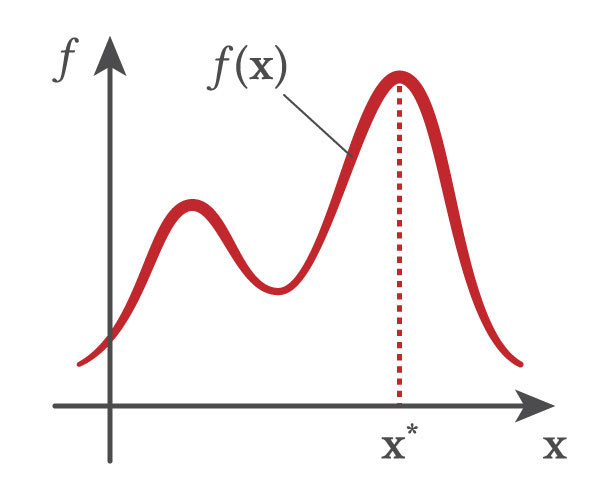
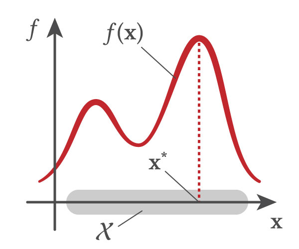

# academic-illustration-assets

Assets for creating illustrative figures (and video figures) released under CC0 (public domain)

## Background

I have published several papers in the computer graphics and human-computer interaction domains. For creating the figures, video figures, and presentation slides of those papers, I repeatedly reused several common assets (such as `pointer.ai` for illustrating GUI interactions). However, every time I tried to do this, I needed to salvage those assets from old projects.

## Goal

The goal of this repository is to improve the reusability of my assets for accelerating future projects.

## Design Principles

### Colors

- Black: `#231F20`, `#4C4C4D`
- Accent: `#CE6B68`, `#C1272D`

### Illustrators (`*.ai`)

- Color mode: RGB
- Units: Pixels
- PDF compatible file

### After Effects (`*.aep`)

- 29.97 fps (`pointer.aep`)
- 30.00 fps (the others including future assets)

### Fonts

- Linux Libertine (`brew cask install font-linux-libertine`)
- Linux Biolinum (`brew cask install font-linux-biolinum`)

Math equations are rendered through LaTeX with the following options:
```latex
\usepackage{libertine}
\usepackage[libertine]{newtxmath}
```

### Font Sizes

- 96pt

## Assets

| file name       | preview                         |
| :-------------- | :------------------------------ |
| pointer         |          |
| pointer-zoom    |     |
| 1-slider-window |  |
| slider-00       |        |
| ...             | ...                             |
| slider-05       |        |
| ...             | ...                             |
| slider-10       |        |
| dnn-1           |            |
| dnn-2           |            |
| function-1      |       |
| function-2      |       |
| speaker-0       |        |
| speaker-1       |        |
| speaker-2       |        |
| speaker-3       |        |
| loading         |          |
